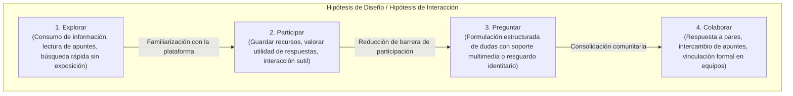

# Análisis de Necesidades y Oportunidades de Diseño

> [!NOTE]
> El presente análisis se basa en los resultados documentados en la [Encuesta de necesidades académicas y de comunidad estudiantil](./encuesta_necesidades_estudiantiles.md).
>
> **Principio metodológico fundamental:** La encuesta proporciona evidencia empírica preliminar sobre necesidades percibidas; no determina por sí sola las funcionalidades definitivas del sistema. Su propósito en esta etapa es guiar la comprensión de problemas y fundamentar hipótesis de diseño antes de la especificación formal de requerimientos de software.

---

## 1. Contexto del análisis

El proyecto **NEXO** surge con la finalidad de atender problemáticas de comunicación, aprendizaje colaborativo y preservación del conocimiento que experimentan los estudiantes en su cotidianidad académica.

Para que las futuras decisiones de ingeniería y diseño de software respondan a realidades comprobadas y no a conjeturas no fundamentadas, se aplicó un instrumento exploratorio a estudiantes del Tecnológico de Estudios Superiores de Huixquilucan (TESH). El presente documento interpreta los patrones identificados en los datos, delimita las problemáticas observadas, deriva las necesidades del usuario y propone un abanico de oportunidades conceptuales de diseño, preparando la base metodológica para la fase posterior de especificación en [`docs/02_requerimientos/requerimientos.md`](../02_requerimientos/requerimientos.md).

---

## 2. Fuente de evidencia

La evidencia empírica primaria analizada en este documento proviene íntegramente de la [Encuesta de necesidades académicas y de comunidad estudiantil](./encuesta_necesidades_estudiantiles.md), administrada de forma digital y estructurada en:

- **14 preguntas cerradas** (opción múltiple, escalas ordinales y selección priorizada), contestadas por \(N = 13\) participantes.
- **1 pregunta abierta**, con \(n = 7\) respuestas cualitativas registradas.

---

## 3. Criterios metodológicos

Para asegurar consistencia, rigor científico y trazabilidad en la ingeniería de software, toda deducción analítica debe someterse a la siguiente jerarquía metodológica:

```text
DATO
  ↓
HALLAZGO
  ↓
NECESIDAD
  ↓
OPORTUNIDAD
  ↓
REQUISITO
```

- **Dato:** Lo que los estudiantes respondieron directamente en el instrumento (conteos, frecuencias porcentuales y categorías cualitativas).
- **Hallazgo:** Patrón observable y objetivo derivado del análisis de los datos, exento de afirmaciones causales no demostradas.
- **Necesidad:** Carencia o problema operativo que puede inferirse razonablemente a partir de uno o más hallazgos.
- **Oportunidad:** Dirección conceptual de diseño planteada para responder a una necesidad, manteniendo carácter exploratorio.
- **Requisito:** Decisión formal de software (RF o RNF) sujeta a especificación técnica, priorización y validación futura. En esta fase de análisis, los requisitos permanecen como **Pendientes** o **No definidos en esta fase**.

> [!WARNING]
> **Regla de no conversión automática:** Ninguna oportunidad conceptual debe transformarse unilateralmente en un requisito definitivo del sistema. Por ejemplo, que el 46.2% consulte a compañeros para resolver dudas respalda la necesidad de facilitar la comunicación entre pares, pero **no implica de forma forzosa que NEXO deba construir una red social**. Dicha elección corresponde a decisiones de diseño que deberán formalizarse y evaluarse en la fase de requerimientos.

---

## 4. Análisis de resultados

La interpretación de las 15 preguntas del instrumento se organiza en cuatro áreas temáticas complementarias:

### 4.1 Resolución de dudas y consulta de información (P01, P03, P14)
- Los estudiantes recurren simultáneamente a fuentes humanas (compañeros y docentes con 46.2% cada uno) y a herramientas de Inteligencia Artificial (46.2%), complementadas por buscadores web (30.8%).
- La confiabilidad técnica (30.8%), la sobrecarga informativa (23.1%), la insuficiente especificidad contextual (23.1%) y la necesidad de formular reiteradamente la misma pregunta (23.1%) representan los principales obstáculos al indagar respuestas.
- En la priorización estricta (P14), el acceso a información rápida (76.9%) y la resolución de dudas (61.5%) se posicionan como las prioridades declaradas de mayor peso.

### 4.2 Preservación, organización y recuperación del conocimiento (P02, P04, P12)
- El 53.8% utiliza directamente la información encontrada y el 46.2% procura guardarla; sin embargo, solo el 23.1% la comparte y un 15.4% la incorpora sistemáticamente a apuntes personales.
- El 76.9% califica como "Regular" la facilidad para volver a encontrar información vista previamente, demostrando que los medios habituales generan pérdida o desorganización de recursos útiles.
- La organización taxonómica estructurada por temas (46.2%) y por categorías (46.2%) es ampliamente preferida frente a la búsqueda desestructurada por palabras clave (23.1%).

### 4.3 Interacción social, afinidad y barreras de participación (P05, P06, P07, P08, P10)
- El interés de vinculación estudiantil se orienta enfáticamente a actividades colaborativas y formativas: compartir conocimientos (46.2%), proyectos conjuntos (38.5%) y estudio compartido (30.8%).
- Conectar con pares afines resulta "Regular" para el 69.2% de los encuestados, denotando falta de visibilidad de intereses compartidos.
- Las principales limitantes para participar no son la falta de interés social, sino la inhibición personal ("Pena / inseguridad", 53.8% en P08 y 46.2% en P07) y la desorientación sobre interlocutores ("no saber a quién preguntar", 30.8%; "no saber con quién interactuar", 38.5%).

### 4.4 Formato técnico de contenidos y problemáticas abiertas (P09, P11, P13, P15)
- Los recursos más valorados para concentrar en un solo lugar son apuntes (46.2%), tutoriales prácticos (38.5%) y ejercicios resueltos (38.5%).
- La acción considerada más útil en una plataforma escolar es publicar y responder preguntas (46.2%), seguida de encontrar recursos (38.5%).
- Los contenidos compartidos requieren soporte enriquecido: títulos claros (53.8%), imágenes explicativas (46.2%), archivos complementarios (30.8%) y sintaxis de código de programación (30.8%).
- Las respuestas abiertas (P15) confirman la necesidad de acortar la brecha entre teoría y práctica, así como de facilitar la integración y coordinación efectiva de equipos de trabajo.

---

## 5. Hallazgos principales

A partir del análisis sistemático, se formalizan los siguientes ocho hallazgos principales:

- **H-01 (Acceso expedito a información):** El 76.9% de los encuestados seleccionó *"Información rápida"* dentro de sus prioridades principales (P14), reflejando una demanda crítica por reducir los tiempos de localización de respuestas.
- **H-02 (Resolución recurrente de dudas):** El 61.5% priorizó la atención de *"Dudas"* (P14) y el 46.2% destacó *"Publicar / responder preguntas"* como la acción más útil (P11), confirmando la centralidad de este ciclo en la vida académica.
- **H-03 (Incertidumbre sobre la confiabilidad):** El 30.8% de los estudiantes señaló la confiabilidad como la principal dificultad al buscar ayuda (P03), reflejando la necesidad de contar con criterios de validación en los contenidos consultados.
- **H-04 (Déficit en la recuperación de información):** El 76.9% valoró como *"Regular"* la facilidad para relocalizar explicaciones o recursos visualizados con anterioridad (P04).
- **H-05 (Barrera de participación por fricción social):** El 53.8% identificó la *"Pena / inseguridad"* como un obstáculo para participar en entornos escolares digitales (P08) y el 46.2% la señaló como dificultad al solicitar ayuda a otros estudiantes (P07).
- **H-06 (Orientación académica de la interacción):** Los mayores intereses de interacción radican en *"Compartir conocimientos"* (46.2%) y *"Desarrollar proyectos"* (38.5%) (P06), evidenciando que la interacción deseada tiene base colaborativa y no puramente recreativa.
- **H-07 (Preferencia por taxonomía estructurada):** El 46.2% prefiere organizar y buscar contenido por *"Tema"* y el 46.2% por *"Categorías"* (P12), superando el uso exclusivo de términos sueltos de búsqueda (23.1%).
- **H-08 (Demanda de contenido práctico y soporte técnico):** Se observa una alta preferencia por apuntes (46.2%), tutoriales (38.5%) y ejercicios (38.5%) (P09), acompañados por la necesidad de integrar imágenes (46.2%), archivos adjuntos (30.8%) y fragmentos de código (30.8%) en las publicaciones (P13).

---

## 6. Necesidades identificadas

De los hallazgos descritos se derivan las siguientes necesidades centrales, clasificadas en dos dimensiones:

### 6.1 Necesidades académicas e informacionales
- **NEC-01 (Acceso ágil y centralizado):** Los estudiantes necesitan reducir la dispersión y el tiempo invertido en localizar explicaciones académicas precisas.
- **NEC-02 (Resolución asistida y entre pares):** Los estudiantes necesitan consultar dudas técnicas y recibir aportes fundamentados tanto de compañeros como de herramientas automatizadas.
- **NEC-03 (Verificación y certeza de contenidos):** Los estudiantes necesitan elementos visibles de valoración o moderación para juzgar la confiabilidad y vigencia de las respuestas.
- **NEC-04 (Organización y preservación personal del conocimiento):** Los estudiantes necesitan almacenar, catalogar y relocalizar con facilidad los recursos de aprendizaje que han considerado valiosos.
- **NEC-08 (Expresión técnica estructurada):** Los estudiantes necesitan formular consultas que integren capturas visuales, archivos y fragmentos de código debidamente indentados y legibles.

### 6.2 Necesidades sociales y de interacción
- **NEC-05 (Entorno de participación de baja fricción):** Los estudiantes necesitan dinámicas de interacción que atenúen el temor al juicio social ("pena / inseguridad") y posibiliten aportes progresivos.
- **NEC-06 (Descubrimiento por afinidad técnica):** Los estudiantes necesitan identificar compañeros con intereses académicos afines o conocimientos complementarios para colaborar.
- **NEC-07 (Articulación y conformación de equipos):** Los estudiantes necesitan mecanismos ordenados para publicar convocatorias y consolidar equipos de trabajo en proyectos escolares.

---

## 7. Oportunidades de diseño

Las siguientes oportunidades representan posibles direcciones conceptuales de diseño orientadas a satisfacer las necesidades identificadas. Se registran con carácter de hipótesis o propuestas de trabajo, no como decisiones definitivas de alcance:

1. **Módulo estructurado de Preguntas y Respuestas (Q&A):** Repositorio persistente de consultas categorizadas que evite la pérdida de información común en chats de mensajería instantánea.
2. **Motor de búsqueda optimizado con recuperación ágil:** Mecanismo de consulta indexado por asignaturas, temas y palabras clave con autocompletado y baja latencia.
3. **Taxonomía temática y por categorías curriculares:** Arquitectura de información estructurada en concordancia con los programas de estudio del TESH.
4. **Sistema de marcadores, guardado e historial de consultas:** Funcionalidad personal para archivar respuestas y revisar el historial de navegación de recursos.
5. **Catálogo estructurado de recursos prácticos:** Sección orientada a almacenar apuntes de materias, tutoriales breves y bancos de ejercicios resueltos.
6. **Perfiles académicos basados en intereses y materias:** Visualización de áreas de interés técnico, materias cursadas y proyectos en desarrollo.
7. **Espacio para convocatorias y coordinación de proyectos:** Mecanismo que facilite la búsqueda de integrantes con perfiles afines para formar equipos escolares.
8. **Editor enriquecido para contenido técnico:** Soporte para Markdown, bloques de sintaxis de código fuente con resaltado, carga de diagramas e imágenes.
9. **Mecanismos de participación gradual:** Diseño de experiencia que permita el involucramiento progresivo del usuario (lectura pasiva → guardado/voto → comentarios → creación de contenido).
10. **Publicaciones con resguardo de identidad (Hipótesis sujeta a validación):** Opción exploratoria para formular preguntas sensibles o iniciales de materias complejas sin exponer públicamente el nombre del estudiante.

> [!WARNING]
> **Tratamiento metodológico de anonimato y gamificación:** Si bien los datos evidencian la presencia de inhibición social ("pena / inseguridad", 53.8%), esto **no valida por sí solo que la solución técnica deba ser el anonimato total ni esquemas de gamificación**. Ambas vías constituyen **hipótesis de diseño preliminares** que requerirán análisis de riesgos de abuso, moderación de contenidos y validación formal con usuarios antes de ser consideradas para especificación funcional.

---

## 8. Hipótesis de interacción

Se formula la siguiente **hipótesis de diseño / hipótesis de interacción** para guiar la conceptualización del flujo de usuario en NEXO:

> *"El sistema podría facilitar una transición gradual desde el consumo pasivo de información hacia la interacción de baja fricción, y posteriormente hacia la formulación abierta de preguntas y la colaboración académica profunda."*

Esta hipótesis propone un recorrido progresivo de adopción estructurado en cuatro etapas:



> [!IMPORTANT]
> **Estatus de la hipótesis:** Esta propuesta describe un modelo conceptual de adopción de usuario para mitigar la fricción social detectada en el estudio. **No constituye un requisito de software, ni una arquitectura técnica, ni un flujo de pantallas definitivo**. Su viabilidad deberá evaluarse mediante prototipos de baja y alta fidelidad en la fase de diseño UX/UI.

---

## 9. Matriz de trazabilidad

La siguiente matriz conecta de manera explícita cada dato y hallazgo de la investigación con su correspondiente necesidad, oportunidad de diseño y estatus de requisito formal:

| ID | Pregunta | Dato / Hallazgo | Necesidad | Oportunidad de Diseño | Requisito Formal |
|:---:|:---:|---|---|---|:---:|
| **H-01** | P14 | 76.9% prioriza *"Información rápida"* | NEC-01: Acceso ágil y centralizado | Motor de búsqueda indexado y baja latencia de consulta | *Pendiente* |
| **H-02** | P14, P11 | 61.5% prioriza dudas (P14); 46.2% publicar/responder (P11) | NEC-02: Resolución colaborativa de dudas | Módulo estructurado y persistente de Q&A | *Pendiente* |
| **H-03** | P03 | 30.8% señala la confiabilidad como dificultad | NEC-03: Verificación y certeza de contenidos | Mecanismos de valoración comunitaria y moderación | *Pendiente* |
| **H-04** | P04, P02 | 76.9% califica recuperación como "Regular"; 46.2% guarda | NEC-04: Organización y preservación personal | Sistema de marcadores, guardado e historial de consultas | *Pendiente* |
| **H-05** | P08, P07 | 53.8% pena/inseguridad (P08); 46.2% pena (P07) | NEC-05: Entorno de baja fricción social | Participación gradual e hipótesis de resguardo identitario | *Pendiente* |
| **H-06** | P06, P05 | 46.2% compartir conocimiento; 69.2% regular conocer afines | NEC-06: Descubrimiento por afinidad técnica | Perfiles académicos basados en intereses y materias | *Pendiente* |
| **H-07** | P12 | 46.2% prefiere tema; 46.2% prefiere categorías | NEC-01 / NEC-04: Estructura taxonómica | Arquitectura de información por temas y categorías | *Pendiente* |
| **H-08** | P09, P13 | 46.2% apuntes; 46.2% imágenes; 30.8% código y archivos | NEC-08: Expresión técnica estructurada | Repositorio de recursos y editor técnico con Markdown | *Pendiente* |
| **H-09** | P10, P15 | 38.5% proyectos; 30.8% equipos; problemas abiertos P15 | NEC-07: Articulación de equipos | Espacios para convocatoria y estructuración de proyectos | *Pendiente* |

> [!NOTE]
> En estricto apego al marco de ingeniería de software, la columna **Requisito Formal** permanece en estatus **"Pendiente"** para la totalidad de las filas, dado que la definición de Requerimientos Funcionales (RF) y No Funcionales (RNF) corresponde a la etapa documentada en [`docs/02_requerimientos/requerimientos.md`](../02_requerimientos/requerimientos.md).

---

## 10. Implicaciones para requisitos

El presente análisis constituye el insumo directo para la ingeniería de requerimientos en `docs/02_requerimientos/`, observando las siguientes directrices:

1. **Entrada directa para el catálogo de requisitos:** Las necesidades NEC-01 a NEC-08 y las oportunidades de diseño documentadas representan la justificación empírica inicial para la formulación de requerimientos funcionales en [`docs/02_requerimientos/requerimientos.md`](../02_requerimientos/requerimientos.md).
2. **Priorización de alcance:** Los hallazgos cuantitativos fundamentan que las funcionalidades orientadas a la velocidad de consulta (H-01) y a la resolución estructurada de dudas (H-02) deberán ponderarse con alta prioridad en el backlog inicial frente a características accesorias.
3. **Validación de hipótesis antes de su congelamiento:** Aspectos como la publicación con resguardo identitario o esquemas de moderación comunitaria deberán pasar por pruebas de concepto y prototipado rápido antes de transformarse en especificaciones rígidas de arquitectura.
4. **Criterio de trazabilidad bidireccional:** Todo requisito que posteriormente se incorpore en `02_requerimientos` deberá poder rastrearse hacia atrás hasta las necesidades y hallazgos aquí expresados.

---

## 11. Limitaciones del análisis

Para mantener un estándar metodológico honesto y riguroso:

1. **Tamaño muestral:** Las conclusiones se fundamentan en una muestra exploratoria de 13 participantes en reactivos estructurados y 7 en reactivos abiertos, lo cual no permite generalizaciones estadísticas universales sobre la totalidad de la comunidad del TESH.
2. **Naturaleza de los datos autodeclarados:** Los hallazgos reflejan intenciones y percepciones declaradas por los estudiantes en un instrumento digital; su comportamiento efectivo frente a la plataforma implementada deberá evaluarse mediante métricas de uso y telemetría en fases avanzadas.
3. **Alcance exploratorio:** La encuesta no sustituye estudios de usabilidad, entrevistas en profundidad ni pruebas piloto con prototipos funcionales, los cuales deberán ejecutarse durante las fases subsecuentes del proyecto.

---

## 12. Conclusiones

1. La evidencia empírica respalda la pertinencia de orientar a NEXO prioritariamente como una **plataforma para la resolución ágil de dudas académicas y la organización de recursos prácticos**, distanciándose de la concepción de una red social de interacción puramente informal o recreativa.
2. La presencia de barreras de exposición social ("pena / inseguridad" en 53.8%) hace imperativo que el diseño centrado en el usuario incorpore un **modelo de participación progresiva de baja fricción** que genere confianza paulatina en el estudiante.
3. Las demandas explícitas por apuntes, tutoriales, ejercicios resueltos y soporte para código e imágenes justifican que el núcleo del sistema cuente con un editor técnico enriquecido y una taxonomía curricular rigurosa.
4. Con la formalización de este documento, la fase de **análisis de necesidades** queda metodológicamente concluida y documentada, proporcionando una base sólida y trazable para avanzar a la especificación formal en `02_requerimientos`.
