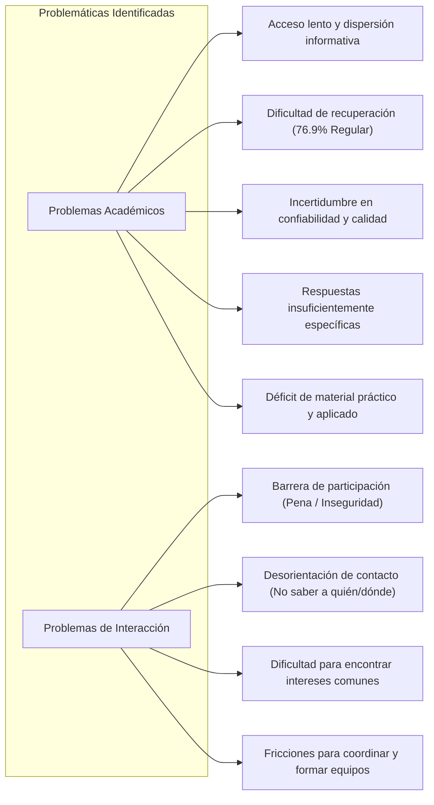
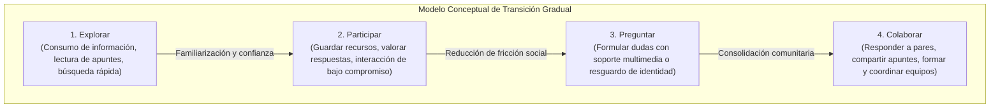

# Análisis de Necesidades y Oportunidades de Diseño

> [!NOTE]
> El presente análisis se basa en los resultados documentados en la [Encuesta de necesidades académicas y de comunidad estudiantil](./encuesta_necesidades_estudiantiles.md).
>
> **Principio metodológico fundamental:** La encuesta proporciona evidencia empírica preliminar sobre necesidades percibidas; no determina por sí sola las funcionalidades definitivas del sistema. Su propósito en esta etapa es guiar la comprensión de problemas y fundamentar hipótesis de diseño antes de la especificación formal de requerimientos de software.

---

## 1. Contexto del análisis

El desarrollo de la plataforma **NEXO** busca atender las problemáticas de comunicación, aprendizaje colaborativo y gestión del conocimiento que experimentan los estudiantes en su entorno académico cotidiano.

Para fundamentar la ingeniería del sistema sobre bases reales y evitar suposiciones no contrastadas, se aplicó un instrumento de investigación exploratoria a estudiantes del Tecnológico de Estudios Superiores de Huixquilucan (TESH). El presente documento interpreta los patrones de respuesta cuantitativos y cualitativos obtenidos, categoriza los problemas subyacentes, deduce las necesidades del usuario y proyecta un catálogo de oportunidades conceptuales de diseño que posteriormente servirán de insumo para la especificación formal en [`docs/02_requerimientos/requerimientos.md`](../02_requerimientos/requerimientos.md).

---

## 2. Hallazgos principales

A partir de la triangulación de los 15 reactivos de la encuesta (\(N = 13\) en preguntas estructuradas y \(n = 7\) en preguntas abiertas), se desprenden los siguientes hallazgos medulares:

### H1 — Acceso rápido a información
El **76.9%** de los participantes seleccionó *"Información rápida"* dentro de los tres problemas más críticos que una plataforma estudiantil debe ayudar a resolver (Pregunta 14). Los estudiantes demandan mecanismos de consulta ágiles que eviten la dispersión y reduzcan el tiempo de localización de respuestas.

### H2 — Resolución de dudas académicas
El **61.5%** de los encuestados posicionó la resolución de *"Dudas"* como una de sus prioridades esenciales (Pregunta 14). Además, el 46.2% consulta activamente tanto a pares y docentes como a motores de Inteligencia Artificial para solventarlas (Pregunta 1), y el 46.2% considera que publicar y responder dudas es la acción más útil dentro de una plataforma comunitaria (Pregunta 11).

### H3 — Confiabilidad de la información
El **30.8%** de los encuestados identificó la confiabilidad de los datos como la principal dificultad al buscar apoyo académico (Pregunta 3). En un contexto donde conviven respuestas informales en redes sociales y respuestas generadas por IA, los estudiantes manifiestan incertidumbre respecto a la validez técnica de la información que consultan.

### H4 — Dificultad para la recuperación de información
El **76.9%** de la muestra calificó como *"Regular"* la facilidad para volver a encontrar información o explicaciones que ya habían visto con anterioridad (Pregunta 4). Aunque el 46.2% procura guardar contenidos útiles (Pregunta 2), la carencia de repositorios personales organizados o historiales estructurados propicia la pérdida recurrente de recursos valiosos.

### H5 — Barrera de participación social y exposición pública
El **53.8%** de los participantes señaló la *"Pena / inseguridad"* como un factor determinante que podría impedirles interactuar o participar en una plataforma escolar (Pregunta 8), y un 46.2% la identificó como el principal obstáculo para solicitar ayuda a otros compañeros (Pregunta 7). Asimismo, el 38.5% declaró "no saber con quién interactuar" y el 30.8% "no saber dónde preguntar".

### H6 — Interés prioritario en la interacción académica
El **46.2%** de los encuestados expresó interés explícito en interactuar para *"Compartir conocimientos"*, el **38.5%** para *"Desarrollar proyectos"* y el **30.8%** para *"Estudiar"* y *"Resolver dudas"* (Pregunta 6). Las motivaciones de vinculación entre estudiantes están fuertemente orientadas al aprendizaje conjunto y a la colaboración técnica, por encima de una socialización de carácter genérico o recreativo.

### H7 — Preferencia por organización taxonómica y temática
Tanto el criterio de *"Tema"* como el de *"Categorías"* obtuvieron un **46.2%** de preferencia cada uno al consultar cómo prefieren localizar contenidos (Pregunta 12), superando a la búsqueda simple no estructurada por palabras clave (23.1%). Esto indica la conveniencia de proveer una arquitectura de información jerárquica y categorizada.

### H8 — Demanda de contenido práctico y multimedia
Los tipos de contenido valorados como más útiles en un mismo lugar fueron **apuntes** (46.2%), **tutoriales** (38.5%) y **ejercicios** (38.5%), seguidos por esquemas de **preguntas/respuestas** (30.8%) (Pregunta 9). Asimismo, al publicar dudas o recursos, los estudiantes exigen soporte visual y técnico: el 53.8% requiere títulos claros, el 46.2% imágenes explicativas y el 30.8% soporte para archivos adjuntos y bloques de código (Pregunta 13).

---

## 3. Problemas identificados

El análisis de los hallazgos permite distinguir dos dimensiones complementarias de problemáticas que afectan la experiencia del estudiante: problemas de naturaleza estrictamente académica y problemas derivados de la interacción humana en el entorno escolar.

### 3.1 Problemas académicos
1. **Acceso lento o difícil a la información relevante:** Los estudiantes invierten tiempo excesivo triangulando entre múltiples canales desarticulados (buscadores, chats de WhatsApp, notas dispersas) sin obtener soluciones inmediatas.
2. **Dificultad crítica para recuperar información previa:** Los contenidos útiles descubiertos en el pasado tienden a extraviarse por falta de indexación, categorización o herramientas personales de marcadores.
3. **Incertidumbre sobre la confiabilidad de las fuentes:** Coexisten múltiples fuentes que ofrecen respuestas contradictorias o desactualizadas, sin un marco de evaluación o reputación técnica visible.
4. **Respuestas dispersas y poco específicas:** Muchas respuestas disponibles en la web generalista o en modelos de IA no se ajustan al programa de estudios o al contexto particular de las materias del TESH.
5. **Brecha entre contenido teórico y material práctico:** Evidenciada tanto en la pregunta cerrada 9 como en las respuestas abiertas de la pregunta 15, existe escasez de ejemplos aplicados, ejercicios resueltos paso a paso y tutoriales específicos.

### 3.2 Problemas de interacción
1. **Pena e inseguridad ante la exposición grupal:** En el marco de la ingeniería de software y el diseño centrado en el usuario, este factor debe entenderse estrictamente como una **barrera psicosocial de participación**, y no como un diagnóstico clínico o psicológico individual. El temor al juicio de pares, a formular "preguntas obvias" o a recibir comentarios desalentadores inhibe la consulta abierta.
2. **Desorientación de destinatario ("No saber a quién preguntar"):** Los estudiantes a menudo desconocen qué compañeros dominan una materia o cuentan con la disposición para apoyar académicamente.
3. **Desorientación de canal ("No saber dónde preguntar"):** Inexistencia de un espacio formal centralizado y ordenado, lo que provoca que las dudas enviadas a grupos masivos se diluyan o ignoren rápidamente.
4. **Dificultad para identificar pares con intereses compartidos:** Falta de visibilidad de perfiles académicos que impidan encontrar colaboradores afines para temas de especialidad o proyectos extracurriculares.
5. **Fricciones para formar y coordinar equipos de trabajo:** Identificado prominentemente en las respuestas cualitativas, el proceso de estructurar equipos balanceados y con niveles equivalentes de compromiso representa un desafío recurrente.

> [!IMPORTANT]
> **Aclaración analítica sobre socialización:** Es incorrecto concluir que "los estudiantes no desean socializar o relacionarse". Los datos demuestran un interés contundente en compartir conocimientos (46.2%), colaborar en proyectos (38.5%), estudiar en conjunto (30.8%) y formar equipos (30.8%). La interpretación correcta es que **existe una alta disposición hacia la interacción colaborativa, pero coexisten barreras de fricción social y desorientación operativa que la restringen**.

---

## 4. Necesidades del usuario

A partir de los problemas caracterizados, se sintetizan las siguientes necesidades centrales que demandan los estudiantes:

| Código | Necesidad Identificada | Descripción |
|---|---|---|
| **NEC-01** | **Acceso expedito y centralizado** | Disponer de un canal unificado para localizar respuestas y explicaciones de manera inmediata sin navegar por múltiples plataformas externas. |
| **NEC-02** | **Resolución colaborativa de dudas** | Formular consultas académicas y recibir respuestas contextualizadas provenientes tanto de compañeros avanzados como de aportes enriquecidos por tecnología. |
| **NEC-03** | **Evaluación de calidad y confianza** | Mecanismos visibles que certifiquen o ponderen la veracidad, vigencia y utilidad práctica de las soluciones publicadas. |
| **NEC-04** | **Preservación y organización del conocimiento** | Facilidad para etiquetar, clasificar, guardar y recuperar instantáneamente recursos y explicaciones previamente localizadas. |
| **NEC-05** | **Entorno de baja fricción y participación segura** | Mecanismos de interacción que disminuyan la ansiedad de exposición social y faciliten el involucramiento paulatino de los estudiantes tímidos o inseguros. |
| **NEC-06** | **Vinculación por afinidad académica** | Visibilidad de perfiles estudiantiles en función de materias, habilidades técnicas, intereses y proyectos en desarrollo. |
| **NEC-07** | **Facilitación del trabajo colaborativo** | Herramientas de soporte para el descubrimiento de integrantes y organización de equipos de trabajo enfocados en proyectos. |
| **NEC-08** | **Expresión técnica y soporte multimedia** | Capacidad de enriquecer las consultas con capturas visuales, diagramas, archivos complementarios y fragmentos de código debidamente formateados. |

---

## 5. Oportunidades de diseño

Las siguientes oportunidades representan conceptos de solución derivados de las necesidades del usuario. Deben entenderse como **oportunidades conceptuales de diseño** y no como requisitos obligatorios o arquitectura técnica definitiva:

1. **Módulo de Preguntas y Respuestas Académicas (Q&A):** Espacio estructurado donde las dudas queden registradas de manera persistente, evitando que se pierdan en el flujo continuo de mensajería instantánea.
2. **Motor de búsqueda optimizado con recuperación ágil:** Mecanismo de indexación rápida con autocompletado y filtros para localizar preguntas resueltas, materiales y publicaciones con mínima latencia.
3. **Taxonomía basada en temas, materias y categorías:** Estructura de navegación jerarquizada que permita a los usuarios explorar contenidos según el plan de estudios, carrera o disciplina técnica.
4. **Sistema de guardado, marcadores e historial:** Funcionalidad personal que permita a los estudiantes archivar explicaciones útiles y revisar rápidamente su historial de consultas.
5. **Repositorio estructurado de contenidos prácticos:** Secciones dedicadas para categorizar apuntes, tutoriales breves, ejercicios con solución y proyectos de referencia.
6. **Perfiles académicos basados en competencias e intereses:** Visualización de intereses disciplinares y materias cursadas para propiciar el descubrimiento de pares con aficiones comunes.
7. **Espacios para comunidades y formación de equipos:** Mecanismos que faciliten la publicación de convocatorias para conformar equipos de proyectos o grupos de estudio temáticos.
8. **Editor enriquecido para contenido técnico:** Soporte nativo para Markdown, bloques de sintaxis de código con resaltado, carga de imágenes ilustrativas y adjuntos de documentos.
9. **Mecanismos de participación gradual:** Diseño de interacción que permita al usuario iniciar como lector pasivo y transicionar con mínima fricción hacia la interacción activa (ej. reacciones, votos o comentarios breves).
10. **Publicaciones anónimas o con seudónimo (Hipótesis sujeta a validación):** Alternativa para plantear dudas sensibles o de materias iniciales resguardando la identidad pública del estudiante.

> [!WARNING]
> **Nota de rigor conceptual sobre anonimato y gamificación:** Si bien la encuesta evidencia una necesidad clara de reducir la fricción social ("pena / inseguridad" con 53.8%), esto **no valida por sí solo que la solución definitiva deba ser el anonimato absoluto o la implementación de mecánicas de gamificación**. Ambas vías deben considerarse como **hipótesis de diseño preliminares** que requerirán análisis de impacto ético, moderación de abusos y validación específica en etapas posteriores de requerimientos.

---

## 6. Modelo conceptual de interacción

Como hipótesis central para la experiencia de usuario de NEXO, se plantea que:

> *"El sistema podría facilitar una transición gradual desde el consumo pasivo de información hacia la participación de baja fricción, y posteriormente hacia la formulación activa de preguntas y la colaboración académica profunda."*

Este modelo busca amortiguar la barrera de participación identificada en la investigación mediante cuatro etapas progresivas de involucramiento:

1. **Explorar:** El estudiante accede a la plataforma principalmente a satisfacer una urgencia académica inmediata (búsqueda de información rápida, lectura de un apunte o consulta de una duda resuelta). No se le exige exposición pública.
2. **Participar (Interacción de bajo compromiso):** El usuario interactúa de forma sutil: guarda una publicación, marca un recurso como útil o califica la claridad de una respuesta. Esto construye sentido de pertenencia sin costo social.
3. **Preguntar:** Conociendo el entorno y las normas comunitarias, el estudiante se anima a estructurar y publicar sus propias dudas, apoyado por plantillas, inserción de capturas/código y, eventualmente, opciones de resguardo identitario.
4. **Colaborar:** El usuario madura dentro de la plataforma hacia roles activos: responde dudas de otros estudiantes, comparte apuntes propios y se vincula en equipos de desarrollo o estudio.

> [!NOTE]
> Este modelo describe el comportamiento de adopción esperado y no representa una especificación de arquitectura de software ni un flujo de pantallas cerrado.

---

## 7. Matriz de trazabilidad (Evidencia → Necesidad → Oportunidad)

La siguiente matriz establece la correlación directa entre los datos empíricos de la encuesta, las necesidades analíticas derivadas y las oportunidades conceptuales de diseño propuestas para NEXO:

| Evidencia Empírica de la Encuesta | Necesidad Derivada | Oportunidad Conceptual de Diseño |
|---|---|---|
| **76.9%** información rápida (P14) | Acceso eficiente y centralizado | Motor de búsqueda indexado y consulta con baja latencia |
| **61.5%** dudas (P14); **46.2%** publicar/responder (P11) | Resolución colaborativa de dudas | Módulo persistente de preguntas y respuestas (Q&A) |
| **30.8%** confiabilidad como dificultad (P3) | Calidad y certeza de la información | Mecanismos comunitarios de moderación, votación y valoración |
| **76.9%** recuperación evaluada como "Regular" (P4) | Organización y relocalización ágil | Taxonomía por temas/categorías, historial y marcadores |
| **53.8%** pena / inseguridad (P8); **46.2%** pena (P7) | Baja fricción social ante la exposición | Modelo de participación progresiva e hipótesis de publicación resguardada |
| **46.2%** compartir conocimiento (P6); **46.2%** apuntes (P9) | Intercambio de recursos de aprendizaje | Repositorio organizado de apuntes, tutoriales y ejercicios |
| **38.5%** proyectos (P6, P10); respuestas abiertas P15 | Trabajo colaborativo y articulación | Espacios para convocatoria y coordinación de equipos de proyecto |
| **30.8%** intereses similares (P6, P11); **69.2%** regular conocer afines (P5) | Descubrimiento social y afinidad | Perfiles académicos basados en materias e intereses técnicos |
| **46.2%** imágenes; **30.8%** archivos y código (P13) | Expresión técnica estructurada | Editor con soporte para Markdown, bloques de código e imágenes |

---

## 8. Implicaciones para la ingeniería de requerimientos

El análisis desarrollado en este documento define la frontera conceptual entre la **investigación empírica** y la **especificación formal de requerimientos**:

1. **Alimentación del Catálogo de Requisitos:** Las necesidades sintetizadas (NEC-01 a NEC-08) y las oportunidades conceptuales serán transferidas al documento [`docs/02_requerimientos/requerimientos.md`](../02_requerimientos/requerimientos.md) para ser formalizadas como Requerimientos Funcionales (RF) y Requerimientos No Funcionales (RNF).
2. **Priorización técnica:** Los datos de la encuesta justifican priorizar en etapas tempranas el acceso expedito a información y la resolución de dudas sobre funcionalidades de interacción secundaria.
3. **Criterios de no invención de funcionalidades:** Ninguna funcionalidad de NEXO deberá incorporarse sin un sustento explícito en una necesidad comprobada o en una restricción técnica o de negocio justificada.
4. **Validación iterativa:** Las hipótesis formuladas (tales como la publicación anónima o las dinámicas de equipo) requerirán validación funcional mediante prototipos UX preliminares antes de ser congeladas en el alcance de desarrollo.

---

## 9. Limitaciones metodológicas del análisis

Para mantener una postura científica y transparente dentro del proceso de ingeniería:

- Los hallazgos se sustentan en una muestra no probabilística de \(N = 13\) encuestados, lo que impide extrapolar conclusiones absolutas a la totalidad de la matrícula del TESH.
- Las declaraciones sobre intenciones futuras de uso (ej. disposición a compartir conocimiento) pueden presentar desviaciones respecto a los comportamientos reales una vez implementado el software.
- El análisis no sustituye las pruebas de usabilidad ni los estudios de campo que deberán efectuarse en fases avanzadas del ciclo de vida del producto.

---

## 10. Conclusiones

1. La evidencia empírica respalda la pertinencia de concebir a NEXO como una **plataforma orientada a la resolución ágil de dudas y a la gestión organizada del conocimiento práctico**, más que como una red social generalista.
2. La existencia de barreras de participación ligadas a la inseguridad social (53.8%) exige que el diseño del sistema privilegie la **amigabilidad, la participación progresiva y entornos de interacción controlados y seguros**.
3. La clara demanda por contenidos prácticos estructurados (apuntes, ejercicios, código e imágenes) y por mecanismos de búsqueda taxonómica proporciona una orientación sólida para modelar la arquitectura de información y las funcionalidades nucleares del sistema.
