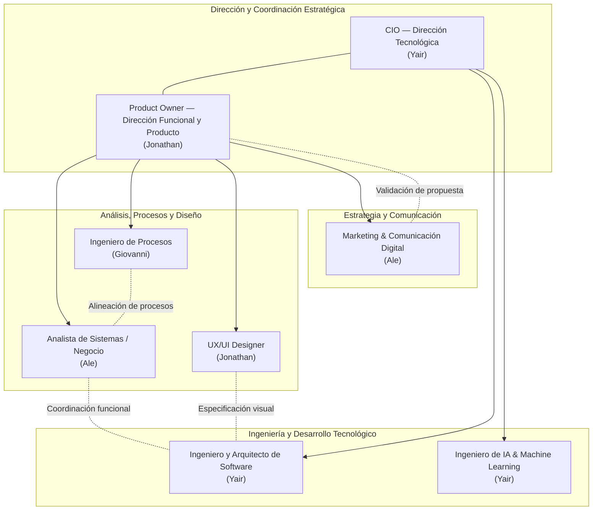

# Gestión del Proyecto

## 1. Introducción

El presente documento formaliza la estructura organizativa, asignación de roles y distribución de responsabilidades del equipo de trabajo a cargo del diseño, desarrollo y puesta en marcha del proyecto **NEXO**.

El propósito fundamental de esta sección es proveer un marco claro de gobernanza funcional y técnica, delimitando las áreas de competencia de cada integrante, promoviendo la sinergia interdisciplinaria y asegurando que las decisiones estratégicas, técnicas y operativas se ejecuten con trazabilidad, calidad y rigor profesional.

---

## 2. Estructura Organizacional

El equipo de proyecto de NEXO opera bajo un modelo de organización funcional y colaborativo adaptado a entornos de ingeniería de software e innovación tecnológica. 

Dado que el equipo está compuesto por profesionales multidisciplinarios donde algunos integrantes ejercen responsabilidades complementarias, la estructura se articula en dos ejes estratégicos coordinados:

1. **Eje de Dirección Tecnológica y Arquitectura:** Enfocado en la gobernanza tecnológica, arquitectura de sistemas, infraestructura, estándares de ingeniería e implementación de componentes inteligentes.
2. **Eje de Dirección Funcional, Producto y Negocio:** Enfocado en la definición de valor del producto, levantamiento analítico de requisitos, optimización de procesos operativos, diseño centrado en el usuario y estrategia comunicativa.

Ambos ejes interactúan de manera continua y horizontal, asegurando que las decisiones de ingeniería respondan a los objetivos funcionales y que las propuestas de producto sean técnicamente viables y escalables.

---

## 3. Equipo del Proyecto

La siguiente tabla resume la estructura oficial de puestos, responsables asignados, áreas de responsabilidad y su función principal dentro del proyecto:

| Puesto | Responsable | Área de responsabilidad | Función principal |
|---|---|---|---|
| **CIO — Chief Information Officer** | Yair | Dirección Tecnológica y Estrategia IT | Dirigir la estrategia tecnológica global, lineamientos de infraestructura, seguridad y supervisión de la viabilidad técnica de la solución. |
| **Product Owner (PO)** | Jonathan | Gestión de Producto y Visión Funcional | Maximizar el valor del producto, administrar el backlog, priorizar requerimientos y validar las entregas funcionales. |
| **Analista de Sistemas / Negocio** | Ale | Análisis de Requisitos y Procesos de Negocio | Relevar, analizar, estructurar y documentar requerimientos funcionales, no funcionales y reglas de negocio del sistema. |
| **Ingeniero y Arquitecto de Software** | Yair | Arquitectura de Software y Construcción | Definir la arquitectura de software, patrones de diseño, componentes estructurales y liderar la construcción técnica del sistema. |
| **Ingeniero de IA & Machine Learning** | Yair | Inteligencia Artificial y Modelos Analíticos | Investigar, diseñar, entrenar, evaluar e integrar modelos de aprendizaje automático y capacidades inteligentes en la plataforma. |
| **Ingeniero de Procesos** | Giovanni | Modelado y Optimización de Procesos | Analizar, modelar, estandarizar y optimizar los flujos de procesos operativos que soporta o automatiza el sistema. |
| **UX/UI Designer** | Jonathan | Experiencia e Interfaz de Usuario | Diseñar la arquitectura de información, flujos de navegación, wireframes, prototipos y guías de estilos visuales. |
| **Marketing & Comunicación Digital** | Ale | Comunicación, Difusión y Estrategia Digital | Diseñar la estrategia de difusión, gestión de imagen institucional, materiales de comunicación y relacionamiento con stakeholders. |

---

## 4. Organigrama

A continuación se representa la estructura funcional y colaborativa del equipo del proyecto NEXO:



---

## 5. Asignación de Roles y Responsabilidades

### 5.1 CIO — Chief Information Officer
- **Responsable:** Yair
- **Propósito del rol:** Proveer la dirección tecnológica global del proyecto, asegurando la alineación de las soluciones de ingeniería con la visión estratégica, la viabilidad técnica y los estándares de seguridad y sostenibilidad de la información.
- **Responsabilidades principales:**
  - Definir la visión y gobernanza tecnológica del proyecto.
  - Evaluar y autorizar la adopción de plataformas, librerías, marcos de trabajo e infraestructura.
  - Asegurar la integridad, disponibilidad y seguridad de la información y los sistemas.
  - Coordinar con la dirección de producto la factibilidad técnica y los plazos de entrega tecnológicos.
- **Entregables esperados:**
  - Lineamientos y políticas técnicas del proyecto.
  - Evaluaciones de viabilidad tecnológica y riesgos técnicos.
  - Aprobaciones formales de arquitectura y despliegue.
- **Relación con otros roles:**
  - Colabora estrechamente con el **Product Owner** para la viabilidad técnica del roadmap.
  - Supervisa y orienta las tareas del **Ingeniero y Arquitecto de Software** y del **Ingeniero de IA & Machine Learning**.

### 5.2 Product Owner (PO)
- **Responsable:** Jonathan
- **Propósito del rol:** Representar la visión funcional del proyecto y los intereses de los usuarios y stakeholders, asegurando que el desarrollo entregue el mayor valor posible de forma iterativa e incremental.
- **Responsabilidades principales:**
  - Definir y mantener actualizada la visión y el backlog del producto.
  - Priorizar las historias de usuario y requerimientos funcionales según su impacto y necesidad operativa.
  - Validar y aceptar formalmente los entregables de desarrollo frente a los criterios de aceptación.
  - Facilitar la comunicación entre las expectativas funcionales y el equipo de ingeniería.
- **Entregables esperados:**
  - Backlog del producto priorizado y refinado.
  - Definición de criterios de aceptación por funcionalidad.
  - Plan de entregas e hitos de producto.
- **Relación con otros roles:**
  - Coordina directamente con el **CIO** para balancear prioridades funcionales y restricciones técnicas.
  - Se apoya en el **Analista de Sistemas / Negocio** para el detalle de requisitos y en el **UX/UI Designer** para la conceptualización visual de la solución.

### 5.3 Analista de Sistemas / Negocio
- **Responsable:** Ale
- **Propósito del rol:** Servir de enlace analítico entre las necesidades operativas/funcionales y las especificaciones técnicas del sistema, asegurando claridad, coherencia y completitud en los requisitos.
- **Responsabilidades principales:**
  - Identificar, relevar y formalizar las necesidades y expectativas de los usuarios y procesos.
  - Redactar especificaciones funcionales, diagramas de casos de uso y reglas de negocio.
  - Verificar la coherencia y trazabilidad de los requerimientos durante todo el ciclo de vida del software.
  - Colaborar en la definición de escenarios y casos de prueba funcional.
- **Entregables esperados:**
  - Documentos de especificación de requerimientos (funcionales y no funcionales).
  - Matrices de trazabilidad de requisitos.
  - Casos de uso y especificaciones de reglas de negocio.
- **Relación con otros roles:**
  - Trabaja en conjunto con el **Product Owner** para desglosar el backlog.
  - Colabora con el **Ingeniero de Procesos** para mapear flujos operativos.
  - Provee insumos analíticos estructurados al **Ingeniero y Arquitecto de Software** y al **UX/UI Designer**.

### 5.4 Ingeniero y Arquitecto de Software
- **Responsable:** Yair
- **Propósito del rol:** Diseñar e implementar la estructura técnica, componentes, modelos de datos e integraciones del sistema de software, garantizando calidad, escalabilidad, modularidad y apego a buenas prácticas de ingeniería.
- **Responsabilidades principales:**
  - Diseñar la arquitectura de software (patrones, capas, interfaces y servicios).
  - Diseñar la estructura de base de datos y esquemas de persistencia.
  - Implementar el código fuente de los módulos del sistema según las especificaciones.
  - Conducir refactorizaciones, revisiones de código y pruebas de integración técnica.
- **Entregables esperados:**
  - Documentación de arquitectura de software y decisiones técnicas (ADR).
  - Diagramas de arquitectura, componentes y despliegue.
  - Código fuente probado, versionado y estructurado en el repositorio.
- **Relación con otros roles:**
  - Traduce los requerimientos del **Analista de Sistemas / Negocio** y diseños del **UX/UI Designer** en implementaciones funcionales de código.
  - Integra las capacidades desarrolladas por el **Ingeniero de IA & Machine Learning**.
  - Reporta el estado técnico y arquitectónico al **CIO**.

### 5.5 Ingeniero de IA & Machine Learning
- **Responsable:** Yair
- **Propósito del rol:** Diseñar, desarrollar, entrenar, evaluar y poner en producción los modelos algorítmicos y de aprendizaje automático que sustenten las capacidades inteligentes de la plataforma NEXO.
- **Responsabilidades principales:**
  - Analizar los conjuntos de datos, requerimientos de inferencia y técnicas de modelado analítico requeridas.
  - Diseñar los pipelines de ingesta, preprocesamiento y transformación de datos.
  - Entrenar, calibrar y validar modelos de machine learning e inteligencia artificial.
  - Empaquetar y exponer los modelos mediante servicios o APIs para su consumo por el sistema central.
- **Entregables esperados:**
  - Documentación de modelos de IA, métricas de rendimiento y validación.
  - Scripts de entrenamiento, transformación y evaluación de datos.
  - Módulos y servicios de inferencia integrados al ecosistema de software.
- **Relación con otros roles:**
  - Coordina con el **Ingeniero y Arquitecto de Software** para asegurar una integración óptima y eficiente de los modelos con la aplicación.
  - Consulta con el **Product Owner** y el **Analista de Sistemas / Negocio** los criterios de éxito y casos de uso de IA esperados.
  - Se alinea con los estándares de infraestructura y cómputo definidos por el **CIO**.

### 5.6 Ingeniero de Procesos
- **Responsable:** Giovanni
- **Propósito del rol:** Analizar, estandarizar y optimizar los procesos de negocio y operacionales que involucran al sistema NEXO, asegurando eficiencia operativa, reducción de fricciones y alineación metodológica.
- **Responsabilidades principales:**
  - Mapear el estado actual (*As-Is*) y el estado futuro (*To-Be*) de los procesos vinculados.
  - Identificar cuellos de botella, redundancias y oportunidades de optimización en los flujos operativos.
  - Estandarizar la notación y diagramación de flujos de trabajo (ej. BPMN).
  - Evaluar el impacto de la automatización e incorporación tecnológica en la operativa diaria.
- **Entregables esperados:**
  - Diagramas y mapas formales de procesos de negocio.
  - Fichas y caracterizaciones de procesos.
  - Propuestas de mejora continua y optimización de flujos de trabajo.
- **Relación con otros roles:**
  - Trabaja de manera coordinada con el **Analista de Sistemas / Negocio** para alinear los procesos con los requisitos del software.
  - Provee retroalimentación al **Product Owner** sobre mejoras en la experiencia operativa de los usuarios de proceso.

### 5.7 UX/UI Designer
- **Responsable:** Jonathan
- **Propósito del rol:** Conceptualizar y diseñar la experiencia interactiva, flujos de navegación e interfaz gráfica de usuario del sistema, garantizando usabilidad, accesibilidad, consistencia visual y ergonomía digital.
- **Responsabilidades principales:**
  - Investigar patrones de uso y diseñar la arquitectura de información del aplicativo.
  - Elaborar esquemas conceptuales (wireframes) de baja y alta fidelidad.
  - Crear prototipos interactivos para validación con usuarios y stakeholders.
  - Definir y mantener el sistema de diseño visual (UI kit, paleta tipográfica, iconografía y componentes).
- **Entregables esperados:**
  - Guía de estilos y sistema de diseño de interfaz.
  - Wireframes, flujos de pantalla y prototipos navegables.
  - Especificaciones de diseño y recursos gráficos para el equipo de desarrollo.
- **Relación con otros roles:**
  - Se coordina con el **Product Owner** para materializar la visión funcional en pantallas efectivas.
  - Toma como insumo los requisitos del **Analista de Sistemas / Negocio**.
  - Entrega especificaciones de interfaz al **Ingeniero y Arquitecto de Software** para su implementación en frontend.

### 5.8 Marketing & Comunicación Digital
- **Responsable:** Ale
- **Propósito del rol:** Definir y ejecutar la estrategia de difusión, comunicación institucional, posicionamiento del producto y relacionamiento con el entorno y usuarios clave de NEXO.
- **Responsabilidades principales:**
  - Diseñar la narrativa, mensajes clave y tono de comunicación del proyecto.
  - Elaborar materiales divulgativos, presentaciones y contenidos informativos.
  - Identificar canales de difusión pertinentes para la promoción del sistema.
  - Analizar la percepción de los usuarios para retroalimentar la propuesta de valor del producto.
- **Entregables esperados:**
  - Plan de comunicación y difusión del proyecto.
  - Materiales informativos, presentaciones institucionales y contenidos de soporte.
  - Informes de alcance y recepción del proyecto.
- **Relación con otros roles:**
  - Se alinea con el **Product Owner** para comunicar acertadamente los atributos y valor del producto.
  - Trabaja con el **UX/UI Designer** para asegurar la coherencia de identidad visual de la marca NEXO en todos los puntos de contacto.

---

## 6. Distribución de Responsabilidades

La siguiente matriz detalla la participación y grado de involucramiento de cada rol en las principales áreas y actividades del proyecto.

**Convención utilizada:**
- **P** = Responsable Principal (lidera y ejecuta la actividad o área)
- **A** = Participación / Apoyo (contribuye activamente en la ejecución)
- **C** = Consulta (provee insumos, criterios o retroalimentación técnica/funcional)
- **I** = Informado (se le notifica el estado o los resultados obtenidos)

| Área / Actividad | CIO | PO | Analista | Software | IA/ML | Procesos | UX/UI | Marketing |
|---|:---:|:---:|:---:|:---:|:---:|:---:|:---:|:---:|
| Dirección tecnológica | **P** | C | I | A | A | I | I | I |
| Gestión del producto | C | **P** | A | C | C | A | A | C |
| Análisis de requisitos | C | A | **P** | C | C | A | A | I |
| Arquitectura de software | A | C | C | **P** | A | I | I | I |
| Desarrollo de software | A | I | C | **P** | A | I | A | I |
| Inteligencia artificial | A | C | C | A | **P** | C | I | I |
| Procesos | I | A | A | C | C | **P** | I | I |
| Experiencia de usuario | I | A | A | C | I | C | **P** | A |
| Comunicación y difusión | I | A | A | I | I | I | A | **P** |

---

## 7. Matriz RACI

La matriz RACI formaliza la asignación de responsabilidades para las actividades clave del ciclo de vida del proyecto NEXO, garantizando que cada tarea cuente con un único responsable final de aprobación y rendición de cuentas (*Accountable*).

**Definición de roles RACI:**
- **R (Responsible):** Quien ejecuta la tarea y genera el entregable.
- **A (Accountable):** Quien rinde cuentas de la correcta y completa ejecución de la tarea, con autoridad final de aprobación.
- **C (Consulted):** Persona con experiencia o competencia que es consultada bidireccionalmente previo o durante la ejecución.
- **I (Informed):** Persona a quien se mantiene informada del progreso o conclusión de la tarea de manera unidireccional.

| Actividad Clave del Proyecto | CIO | PO | Analista | Software | IA/ML | Procesos | UX/UI | Marketing |
|---|:---:|:---:|:---:|:---:|:---:|:---:|:---:|:---:|
| Definición de visión y roadmap del producto | C | **A / R** | C | C | C | C | C | C |
| Definición de arquitectura tecnológica e infraestructura | **A** | C | I | **R** | C | I | I | I |
| Relevamiento y especificación de requerimientos | C | **A** | **R** | C | C | C | C | I |
| Modelado y optimización de procesos de negocio | I | C | C | I | I | **A / R** | I | I |
| Diseño de arquitectura de información y prototipos UX/UI | I | C | C | C | I | C | **A / R** | C |
| Construcción, codificación y pruebas unitarias de software | C | I | I | **A / R** | C | I | C | I |
| Investigación, entrenamiento e integración de modelos de IA | C | C | I | C | **A / R** | I | I | I |
| Estrategia de difusión, comunicación y posicionamiento | I | C | I | I | I | I | C | **A / R** |
| Aprobación formal de versiones para despliegue | **A** | C | I | **R** | C | I | I | I |

---

## 8. Fotografías de Integrantes

Las fotografías oficiales de los miembros del equipo se almacenarán en la siguiente ruta dedicada del repositorio:

```
docs/11_gestion_proyecto/fotos_integrantes/
```

A continuación se presenta la tabla para la incorporación gradual de las imágenes conforme sean provistas por los integrantes:

| Integrante | Puesto(s) Oficial(es) | Fotografía |
|---|---|:---:|
| **Yair** | CIO / Ingeniero y Arquitecto de Software / Ingeniero de IA & ML | *Pendiente* |
| **Jonathan** | Product Owner / UX/UI Designer | *Pendiente* |
| **Ale** | Analista de Sistemas / Negocio / Marketing & Comunicación Digital | *Pendiente* |
| **Giovanni** | Ingeniero de Procesos | *Pendiente* |

> **Nota para la incorporación de imágenes:** Una vez colocados los archivos gráficos reales dentro del directorio `fotos_integrantes/`, se actualizará la tabla utilizando referencias relativas de Markdown, por ejemplo:
> ```markdown
> 
> ```

---

## 9. Comunicación y Coordinación

Esta sección sienta las bases para el marco de interacción y seguimiento del equipo de trabajo. Los mecanismos específicos serán definidos y formalizados colaborativamente por los integrantes:

- **Canales de comunicación:** *(Pendiente de formalización por el equipo — herramientas síncronas y asíncronas).*
- **Reuniones y ceremonias:** *(Pendiente de formalización por el equipo — periodicidad, objetivos y participantes de reuniones de sincronización y revisión).*
- **Seguimiento de tareas y avances:** *(Pendiente de formalización por el equipo — tablero y metodología de seguimiento de compromisos).*
- **Gestión de acuerdos y minutas:** *(Pendiente de formalización por el equipo — registro y archivo de decisiones tomadas en sesiones colegiadas).*
- **Gestión de cambios y solicitudes:** *(Pendiente de formalización por el equipo — flujo de evaluación, aprobación e impacto de cambios funcionales o técnicos).*
- **Coordinación entre áreas:** *(Pendiente de formalización por el equipo — protocolos de interacción entre ingeniería, análisis, diseño y difusión).*

---

## 10. Control de Cambios de Roles

En esta sección se registrarán cronológicamente las adiciones, bajas o modificaciones en la asignación de roles y responsabilidades a lo largo del ciclo de vida del proyecto.

| Fecha | Cambio | Responsable de la modificación | Motivo |
|---|---|---|---|
| 2026-09-30 | Definición y formalización inicial de la estructura organizacional y asignación de roles. | Equipo NEXO | Establecimiento de la línea base operativa y organizativa del proyecto. |
